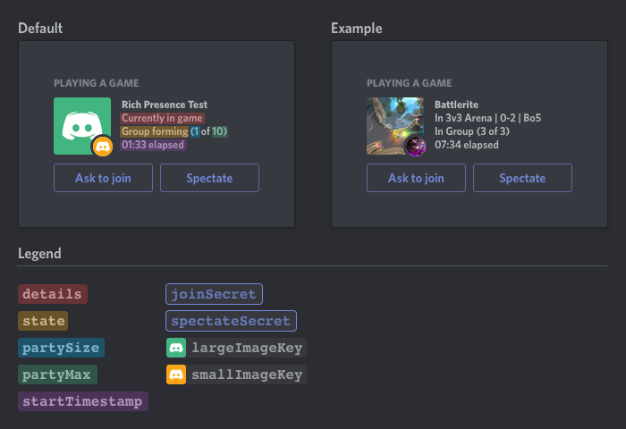

# Discord-Rich-Presence

Discord Rich Presence is a Rich Presence Client (RPC) that show off what users are doing with Discord's status feature

## Getting Started

1. Fork or download this project
2. Go to the [Applications](https://discordapp.com/developers/applications/) page and create a new application.
   1. The name should be whatever you want to be for the status, I.E. "Playing with my friends"
3. Now go to the `Rich Presence` tab > `Art Assets`
   1. Add images you would like to be displayed on the RPC. Make sure to give them names
   2. If you want to use animated images (ie. gif), simply put the url instead of the imageKey
4. Rename `default.json` to whatever you like and edit the properties you need (See #Configuration)

## Running

```sh
node index.js
# or
npm start
```

You can also double click on `start.bat` to run this project in Windows CMD

## Configuration

### General

| Parameters |               Description               |  Type  |
| :--------: | :-------------------------------------: | :----: |
|   appid    |           The application ID            | number |

---

### Discord

|   Parameters   |                       Description                        |  Type   |
| :------------: | :------------------------------------------------------: | :-----: |
|    details     |             What the user is currently doing             | string  |
|     state      |       The user's current state "I.E., In a group"        | string  |
|   partySize    |             Current size of the user's party             | number  |
|    partyMax    |             Maximum size of the user's party             | number  |
| startTimestamp |              Epoch seconds for status start              | boolean |
| largeImageKey  |             Name of the large image you want             | string  |
| largeImageText | Text you want to show when hovering over the large image | string  |
| smallImageKey  |             Name of the small image you want             | string  |
| smallImageText | Text you want to show when hovering over the small image | string  |
|   joinButton   |               Display primary button                     | boolean |
| spectateButton |               Display secondary button                   | boolean |

### Buttons

```
...
"joinButton": {
  "enabled": true,
  "label": "t",
  "url": ""
},
"spectateButton": {
  "enabled": true,
  "label": "",
  "url": ""
}
...
```

|   Name         |                       Description                        |  Type   |
| :------------: | :------------------------------------------------------: | :-----: |
|    enabled     |                  Show or hide the button                 | boolean |
|     label      |             Title to be shown on the button              | string  |
|      url       |            Image key to art assets or direct URL         | string  |

## Preview



# Aknowledgments

- [Discord](https://discord.com/developers/docs/rich-presence/how-to) for theirs docs
